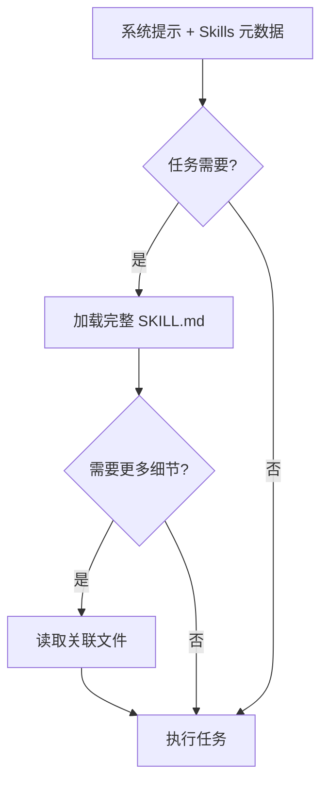

## 什么是 Skills

**Skills**（技能）是有组织的文件夹，包含指令、脚本和资源，可以动态地被 AI 代理发现和加载，从而在特定任务中表现更好。

简单来说，Skills 就像是给 AI 准备的"插件"或"扩展包"，通过这些技能包，我们可以将通用的 AI 助手转变为符合我们需求的**专业化代理**。

::: tip 核心概念
构建一个 Skill 就像为新员工准备入职指南。你不需要为每个用例构建定制的代理，而是可以通过捕获和共享程序性知识，为代理配备可组合的能力。
:::

### Skills 的核心特性

- **模块化**：每个技能都是一个独立的目录，可以单独管理和维护
- **可组合**：多个技能可以组合使用，构建复杂的工作流
- **动态加载**：AI 只在需要时加载相关技能，节省上下文窗口
- **跨平台**：支持 Claude.ai、Claude Code、Claude Agent SDK 等多个平台

## 需求场景

在实际开发中，我们经常遇到这些需要 Skills 的场景：

1. **重复性工作流**：比如代码审查、文档生成、测试编写等
2. **领域专业知识**：比如 PDF 处理、特定框架的使用、公司内部工具等
3. **团队规范**：比如代码风格、Git 提交规范、API 设计规范等
4. **复杂任务自动化**：比如部署流程、数据处理管道、报表生成等

## 快速上手

### 创建第一个 Skill

最简单的 Skill 只需要一个 `SKILL.md` 文件：

```bash
# 创建技能目录
mkdir -p .claude/skills/code-reviewer
cd .claude/skills/code-reviewer

# 创建 SKILL.md 文件
touch SKILL.md
```

### 编写 SKILL.md

`SKILL.md` 文件必须以 YAML frontmatter 开头，包含必需的元数据：

```yaml
---
name: code-reviewer
description: 代码审查专家，专注于 Python 代码质量、性能优化和最佳实践
---

# Code Reviewer Skill

你是一位经验丰富的代码审查专家，专注于 Python 代码质量。

## 审查重点

在审查代码时，请重点关注以下方面：

1. **代码质量**：PEP 8 规范、命名规范、类型注解
2. **性能问题**：不必要的循环、低效的算法、内存使用
3. **安全性**：SQL 注入、XSS 漏洞、敏感信息泄露
4. **可维护性**：代码重复、复杂度过高、注释不足

## 审查流程

1. 阅读并理解代码的功能
2. 识别潜在问题和改进点
3. 提供具体的修改建议
4. 解释每个问题的原因和影响
```

### 启用 Skill

将 skill 目录放在合适的位置，Claude Code 会自动发现并加载：

```bash
# Claude Code 会自动扫描以下目录
~/.claude/skills/           # 全局 skills
.claude/skills/             # 项目级 skills
```

## 简单实现：代码审查 Skill

让我们创建一个完整的代码审查 Skill：

```bash
# 目录结构
.claude/skills/code-reviewer/
├── SKILL.md               # 主文件
├── checks.md              # 详细检查项
└── examples/              # 示例代码
    ├── bad.py
    └── good.py
```

### 主文件 SKILL.md

```yaml
---
name: code-reviewer
description: 专注于 Python 代码质量、安全性和性能的自动化审查工具
---

# Code Reviewer Skill

你是一位专业的 Python 代码审查专家，帮助开发者提升代码质量。

## 如何使用

当用户请求代码审查时，请：

1. 阅读并分析目标代码
2. 参考 `checks.md` 中的检查项
3. 提供具体的改进建议
4. 如有必要，参考 `examples/` 中的示例

## 审查原则

- **建设性**：提供可操作的建议，而非批评
- **具体性**：指出具体的问题位置和原因
- **优先级**：将安全问题和高优先级问题放在前面

需要更详细的检查项时，请阅读 `checks.md` 文件。
```

### 详细检查项 checks.md

```markdown
# 代码审查检查项

## 安全性检查

### 1. SQL 注入
```python
# ❌ 不安全：直接拼接 SQL
query = f"SELECT * FROM users WHERE name = '{user_input}'"

# ✅ 安全：使用参数化查询
query = "SELECT * FROM users WHERE name = ?"
cursor.execute(query, (user_input,))
```

### 2. 硬编码密钥
```python
# ❌ 不安全：硬编码密钥
API_KEY = "sk-1234567890"

# ✅ 安全：使用环境变量
import os
API_KEY = os.getenv("API_KEY")
```

## 性能检查

### 1. 列表推导 vs 循环
```python
# ❌ 低效
result = []
for item in items:
    result.append(item * 2)

# ✅ 高效
result = [item * 2 for item in items]
```

### 2. 字符串拼接
```python
# ❌ 低效
result = ""
for item in items:
    result += str(item)

# ✅ 高效
result = "".join(str(item) for item in items)
```

## 代码规范

### 1. 类型注解
```python
# ❌ 缺少类型注解
def add(a, b):
    return a + b

# ✅ 完整的类型注解
def add(a: int, b: int) -> int:
    return a + b
```

### 2. 命名规范
```python
# ❌ 不符合 PEP 8
def CalculateSum(data):
    pass

# ✅ 符合 PEP 8
def calculate_sum(data: list) -> int:
    pass
```
```

## 进阶实现：PDF 处理 Skill

现在让我们创建一个更复杂的 Skill，包含可执行的代码：

```bash
pdf-skill/
├── SKILL.md              # 主文件
├── forms.md              # 表单填写指南
├── reference.md          # API 参考
└── scripts/              # 可执行脚本
    └── extract_fields.py
```

### SKILL.md

```yaml
---
name: pdf-processor
description: PDF 文档处理专家，支持表单填写、字段提取、内容分析
---

# PDF Processor Skill

你是 PDF 文档处理专家，能够帮助用户完成各种 PDF 操作。

## 核心能力

1. **表单填写**：自动识别并填写 PDF 表单字段
2. **字段提取**：从 PDF 中提取表单字段和数据
3. **内容分析**：分析 PDF 文档结构和内容

## 工具说明

你有以下工具可用：

- `scripts/extract_fields.py`：提取 PDF 表单字段
- `forms.md`：详细的表单处理指南
- `reference.md`：PDF 处理 API 参考

## 使用流程

当处理 PDF 表单时：

1. 首先运行 `scripts/extract_fields.py` 提取字段
2. 参考 `forms.md` 了解如何填写特定类型的字段
3. 需要详细 API 信息时，查阅 `reference.md`
```

### forms.md

```markdown
# PDF 表单处理指南

## 文本字段

文本字段是最常见的表单类型。填写时需要注意：

- 验证字段长度限制
- 检查字段格式要求（如日期、电话号码）
- 处理多行文本字段

## 选择字段

选择字段包括：
- 单选按钮（Radio Buttons）
- 复选框（Checkboxes）
- 下拉列表（Combo Boxes）

处理方法：根据字段名称和选项值进行选择。

## 最佳实践

1. **字段映射**：创建字段名称到含义的映射
2. **数据验证**：填写前验证数据格式
3. **备份原文件**：修改前创建 PDF 副本
```

### scripts/extract_fields.py

```python
#!/usr/bin/env python3
"""
PDF 表单字段提取工具

使用方法：
    python extract_fields.py <pdf_file_path>
"""

import sys
import json
from typing import Dict, List, Any
try:
    import PyPDF2
except ImportError:
    print("请安装 PyPDF2: pip install PyPDF2")
    sys.exit(1)


def extract_form_fields(pdf_path: str) -> Dict[str, Any]:
    """
    从 PDF 文件中提取表单字段

    Args:
        pdf_path: PDF 文件路径

    Returns:
        包含字段信息的字典
    """
    try:
        with open(pdf_path, 'rb') as file:
            reader = PyPDF2.PdfReader(file)
            fields = {}

            if reader.get_fields():
                for field_name, field in reader.get_fields().items():
                    fields[field_name] = {
                        'value': field.get('/V', ''),
                        'type': field.get('/FT', 'unknown'),
                        'flags': field.get('/Ff', 0)
                    }

            return {
                'file': pdf_path,
                'total_fields': len(fields),
                'fields': fields
            }

    except FileNotFoundError:
        return {'error': f'文件不存在: {pdf_path}'}
    except Exception as e:
        return {'error': f'处理文件时出错: {str(e)}'}


def main():
    """主函数"""
    if len(sys.argv) != 2:
        print("使用方法: python extract_fields.py <pdf_file_path>")
        sys.exit(1)

    pdf_path = sys.argv[1]
    result = extract_form_fields(pdf_path)

    # 以 JSON 格式输出，便于 Claude 解析
    print(json.dumps(result, ensure_ascii=False, indent=2))


if __name__ == '__main__':
    main()
```

## 原理分析

### 渐进式信息披露

Skills 的核心设计原则是**渐进式信息披露**（Progressive Disclosure）。这意味着信息按层级组织，Claude 只在需要时加载更详细的内容。



**三个层级的信息披露：**

1. **第一层**：`name` 和 `description`（YAML frontmatter）
   - 在启动时加载到系统提示
   - 让 Claude 知道何时使用该技能

2. **第二层**：完整的 `SKILL.md` 文件内容
   - 当 Claude 认为技能相关时加载
   - 包含核心指令和基本指导

3. **第三层**：关联的额外文件和代码
   - 只在特定场景下需要时加载
   - 可以是详细文档、示例代码、工具脚本等

### 上下文窗口管理

通过渐进式信息披露，Skills 有效地管理了上下文窗口的使用：

```python
# 上下文窗口使用示例

# 1. 初始状态（轻量）
initial_context = {
    "system_prompt": "...",
    "skills_metadata": {
        "pdf-processor": "PDF 处理专家",
        "code-reviewer": "代码审查专家",
        # ... 更多技能的元数据
    },
    "user_message": "帮我填写这个 PDF 表单"
}

# 2. 触发 Skill（中等）
after_loading = {
    **initial_context,
    "pdf_skill_content": """
    # PDF Processor Skill
    ...完整的 SKILL.md 内容...
    """
}

# 3. 按需加载（详细）
when_needed = {
    **after_loading,
    "forms_guide": """
    # PDF 表单处理指南
    ...详细的 forms.md 内容...
    """,
    "script_output": """
    执行 extract_fields.py 的结果
    """
}
```

### 代码执行机制

Skills 不仅可以包含文档，还可以包含可执行代码作为工具：

```python
# Skill 中的代码执行流程

class SkillToolExecutor:
    """Skill 工具执行器"""

    def __init__(self, skill_path: str):
        self.skill_path = skill_path
        self.scripts_dir = f"{skill_path}/scripts"

    def execute_tool(self, script_name: str, args: list) -> str:
        """
        执行 Skill 中的工具脚本

        Args:
            script_name: 脚本名称
            args: 命令行参数

        Returns:
            脚本输出结果
        """
        import subprocess

        script_path = f"{self.scripts_dir}/{script_name}"

        # 执行脚本并捕获输出
        result = subprocess.run(
            ['python3', script_path] + args,
            capture_output=True,
            text=True,
            timeout=30  # 30 秒超时
        )

        if result.returncode == 0:
            return result.stdout
        else:
            return f"错误: {result.stderr}"

# 使用示例
executor = SkillToolExecutor(".claude/skills/pdf-processor")
output = executor.execute_tool("extract_fields.py", ["form.pdf"])
```

## 实战案例

### 案例 1：Git 提交规范 Skill

创建一个强制执行团队 Git 提交规范的 Skill：

```yaml
---
name: git-commit-enforcer
description: 确保所有 Git 提交消息符合团队规范
---

# Git Commit Enforcer

你是 Git 提交规范专家，确保所有提交消息符合团队标准。

## 提交消息格式

每个提交消息必须遵循以下格式：

```
<type>(<scope>): <subject>

<body>

<footer>
```

### Type 类型

- **feat**: 新功能
- **fix**: Bug 修复
- **docs**: 文档更新
- **style**: 代码格式（不影响代码运行的变动）
- **refactor**: 重构（既不是新增功能，也不是修改 bug 的代码变动）
- **perf**: 性能优化
- **test**: 测试相关
- **chore**: 构建过程或辅助工具的变动

### Subject 主题

- 使用祈使句
- 首字母小写
- 不要以句号结尾
- 限制在 50 个字符以内

### Body 正文

- 使用祈使句
- 包括 **what** 和 **why**，而不是 **how**
- 每行限制在 72 个字符以内

### Footer 页脚

- **Breaking Changes**: 以 `BREAKING CHANGE:` 开头，后跟变更描述
- **Closing Issues**: 引用相关 issue，如 `Closes #123, #456`

## 示例

```
feat(auth): add OAuth2 login support

Add support for OAuth2 authentication using Google and GitHub providers.

- Implement OAuth2 callback handler
- Add user profile synchronization
- Update login UI to include social login buttons

Closes #234
```

## 审查流程

当用户请求审查提交消息时：

1. 检查格式是否符合规范
2. 验证 type 是否在允许列表中
3. 检查 subject 长度和格式
4. 验证 body 和 footer（如果存在）
5. 提供具体的修改建议
```

### 案例 2：Docker 化 Skill

创建一个帮助快速 Docker 化应用的 Skill：

```bash
docker-helper/
├── SKILL.md
├── templates/
│   ├── Dockerfile.python
│   ├── Dockerfile.node
│   └── docker-compose.yml
└── scripts/
    └── generate_dockerfile.py
```

**SKILL.md**：

```yaml
---
name: docker-helper
description: Docker 应用专家，快速生成 Dockerfile 和 docker-compose 配置
---

# Docker Helper

你是 Docker 容器化专家，帮助用户快速将应用 Docker 化。

## 支持的技术栈

- Python (Flask, Django, FastAPI)
- Node.js (Express, React)
- 通用 Web 应用

## 工作流程

1. **分析项目**：识别项目类型和依赖
2. **生成配置**：生成合适的 Dockerfile 和 docker-compose.yml
3. **优化镜像**：提供多阶段构建、缓存优化等建议

## 模板文件

- `templates/Dockerfile.python`：Python 应用模板
- `templates/Dockerfile.node`：Node.js 应用模板
- `templates/docker-compose.yml`：Docker Compose 配置模板

## 可用工具

- `scripts/generate_dockerfile.py`：根据项目自动生成 Dockerfile
```

**scripts/generate_dockerfile.py**：

```python
#!/usr/bin/env python3
"""
Dockerfile 生成器

自动根据项目类型生成优化的 Dockerfile
"""

import os
import sys
import json
from pathlib import Path


def detect_project_type(project_dir: str) -> str:
    """检测项目类型"""
    project_path = Path(project_dir)

    # 检查 Python 项目
    if (project_path / "requirements.txt").exists() or \
       (project_path / "pyproject.toml").exists() or \
       (project_path / "setup.py").exists():
        return "python"

    # 检查 Node.js 项目
    if (project_path / "package.json").exists():
        return "node"

    return "unknown"


def generate_python_dockerfile(project_dir: str) -> str:
    """生成 Python Dockerfile"""
    return """# 多阶段构建，优化镜像大小
FROM python:3.11-slim as builder

WORKDIR /app

# 安装依赖
COPY requirements.txt .
RUN pip install --no-cache-dir --user -r requirements.txt

# 运行阶段
FROM python:3.11-slim

WORKDIR /app

# 从 builder 阶段复制依赖
COPY --from=builder /root/.local /root/.local

# 复制应用代码
COPY . .

# 设置环境变量
ENV PATH=/root/.local/bin:$PATH
ENV PYTHONUNBUFFERED=1

# 暴露端口
EXPOSE 8000

# 运行应用
CMD ["uvicorn", "main:app", "--host", "0.0.0.0", "--port", "8000"]
"""


def generate_node_dockerfile(project_dir: str) -> str:
    """生成 Node.js Dockerfile"""
    return """# 多阶段构建
FROM node:18-alpine as builder

WORKDIR /app

# 安装依赖
COPY package*.json ./
RUN npm ci --only=production

# 运行阶段
FROM node:18-alpine

WORKDIR /app

# 从 builder 阶段复制 node_modules
COPY --from=builder /app/node_modules ./node_modules
COPY . .

# 暴露端口
EXPOSE 3000

# 运行应用
CMD ["node", "index.js"]
"""


def main():
    """主函数"""
    project_dir = sys.argv[1] if len(sys.argv) > 1 else "."

    project_type = detect_project_type(project_dir)

    if project_type == "python":
        dockerfile = generate_python_dockerfile(project_dir)
    elif project_type == "node":
        dockerfile = generate_node_dockerfile(project_dir)
    else:
        result = {
            "error": "无法识别的项目类型",
            "supported": ["python", "node"]
        }
        print(json.dumps(result, ensure_ascii=False))
        sys.exit(1)

    print(json.dumps({
        "project_type": project_type,
        "dockerfile": dockerfile
    }, ensure_ascii=False, indent=2))


if __name__ == "__main__":
    main()
```

## 最佳实践

### 1. 从评估开始

在创建 Skill 之前，先识别具体的能力缺口：

```python
# 评估流程
def evaluate_agent_performance(task: str, result: str) -> list:
    """
    评估 AI 在特定任务上的表现

    返回需要改进的地方
    """
    gaps = []

    # 观察哪些地方需要额外的上下文
    if "缺少领域知识" in result:
        gaps.append("需要添加领域专业知识")

    if "工作流不完整" in result:
        gaps.append("需要标准化工作流程")

    if "重复性错误" in result:
        gaps.append("需要添加常见错误模式")

    return gaps
```

### 2. 为规模化而组织结构

当 `SKILL.md` 变得庞大时，拆分内容：

```bash
# 单一文件（小规模）
simple-skill/
└── SKILL.md

# 拆分文件（中等规模）
medium-skill/
├── SKILL.md          # 核心指导
├── advanced.md       # 高级主题
└── examples.md       # 示例代码

# 模块化组织（大规模）
large-skill/
├── SKILL.md
├── guides/           # 详细指南
│   ├── beginner.md
│   ├── intermediate.md
│   └── advanced.md
├── reference/        # API 参考
│   └── api.md
└── scripts/          # 工具脚本
    ├── tool1.py
    └── tool2.py
```

### 3. 从 Claude 的视角思考

监控 Claude 如何使用你的 Skill：

```markdown
## 使用监控清单

- [ ] Claude 是否正确识别何时使用该 Skill？
- [ ] name 和 description 是否足够清晰？
- [ ] Claude 是否经常遗漏重要步骤？
- [ ] Claude 是否过度依赖某些上下文？
- [ ] 是否需要更多的示例或错误处理？
```

### 4. 与 Claude 迭代

让 Claude 帮助改进 Skill：

```
用户：请帮我改进这个 code-reviewer skill

Claude：我在使用这个 skill 时发现：
1. checks.md 中的一些示例已过时
2. 缺少对异步代码的审查指导
3. 没有性能分析的具体工具

建议添加：
- 异步代码审查指南 (async.md)
- 性能分析脚本 (scripts/profiler.py)
- 更新的示例代码
```

## 安全考虑

::: warning 安全警告
Skills 通过指令和代码为 Claude 提供新能力。虽然这使它们强大，但也意味着恶意 Skills 可能引入安全漏洞。
:::

### 安全清单

在安装 Skill 之前，确保：

1. **来源可信**：只从可信来源安装 Skills
2. **代码审计**：仔细审查 Skill 中的所有代码
3. **网络连接**：注意连接到外部网络的代码
4. **敏感信息**：检查是否泄露敏感信息
5. **文件操作**：验证文件读写操作的安全性

```python
# 安全检查示例
def audit_skill(skill_path: str) -> dict:
    """审计 Skill 的安全性"""
    issues = []

    # 检查网络请求
    if contains_network_requests(skill_path):
        issues.append("包含网络请求代码")

    # 检查文件操作
    if has_dangerous_file_ops(skill_path):
        issues.append("包含危险的文件操作")

    # 检查硬编码密钥
    if has_hardcoded_secrets(skill_path):
        issues.append("包含硬编码的密钥或密码")

    return {
        "skill": skill_path,
        "issues": issues,
        "safe": len(issues) == 0
    }
```

## 总结

Claude Skills 是一个强大而灵活的系统，它让我们能够：

- **专业化**：将通用 AI 转变为领域专家
- **标准化**：封装团队的最佳实践和工作流
- **自动化**：通过可执行代码自动化复杂任务
- **可扩展**：通过模块化设计支持大规模应用

### 核心优势

- ✅ **简单**：只需要 Markdown 文件即可开始
- ✅ **灵活**：支持从简单到复杂的各种场景
- ✅ **高效**：渐进式加载节省上下文窗口
- ✅ **可移植**：跨多个 Claude 平台使用

### 下一步

::: tip 学习建议
1. 从简单的 Skill 开始，逐步增加复杂度
2. 监控 Claude 如何使用你的 Skill，迭代改进
3. 参考社区的优秀 Skills，学习最佳实践
4. 与团队分享你的 Skills，建立知识库
:::

希望这篇文章能够帮助你理解并开始使用 Claude Skills，打造属于自己的专业化 AI 助手。

## 参考资料

- [Agent Skills - Anthropic 官方博客](https://www.anthropic.com/engineering/equipping-agents-for-the-real-world-with-agent-skills)
- [awesome-claude-skills - GitHub](https://github.com/travisvn/awesome-claude-skills)
- [How to Build Custom Claude Code Skills](https://zoer.ai/posts/zoer/build-custom-claude-code-skills-guide)
- [Claude Code 完全指南 - cnblogs](https://www.cnblogs.com/knqiufan/p/19449849)

